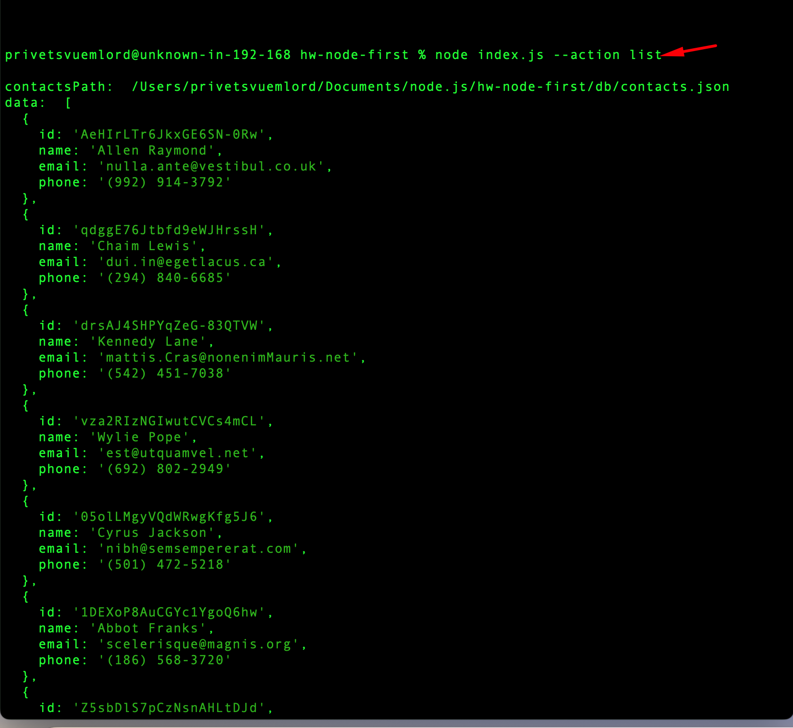
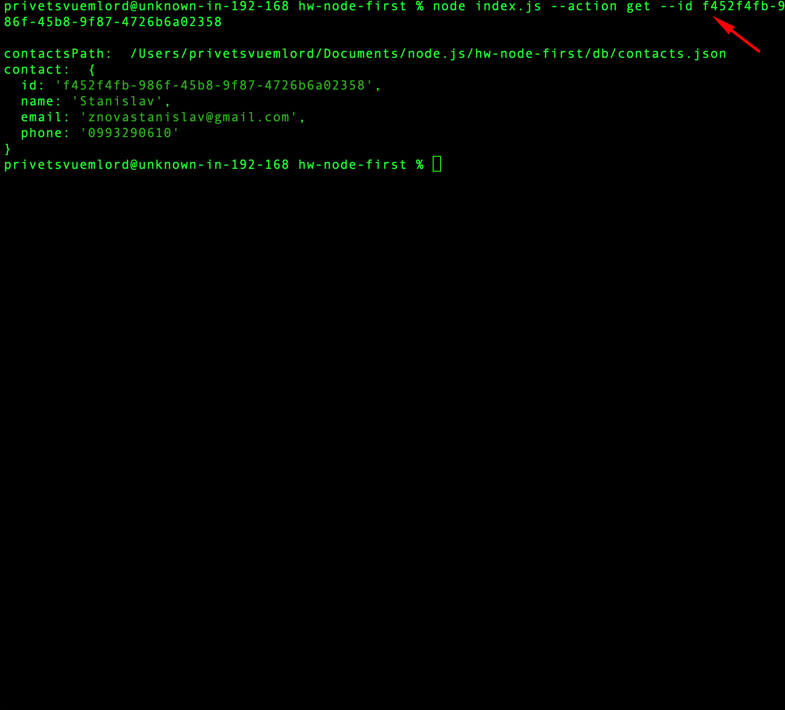
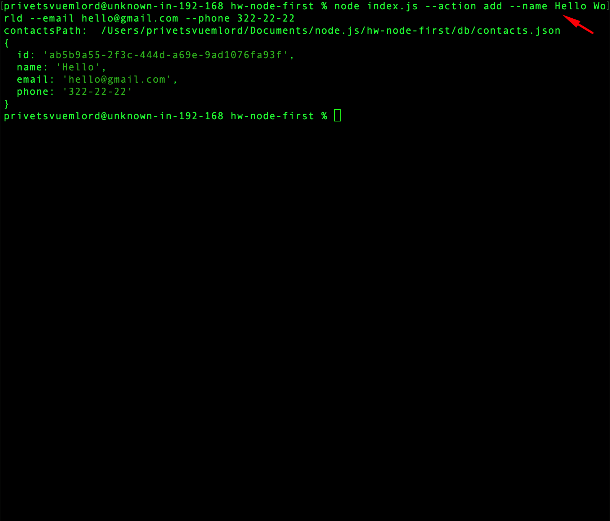
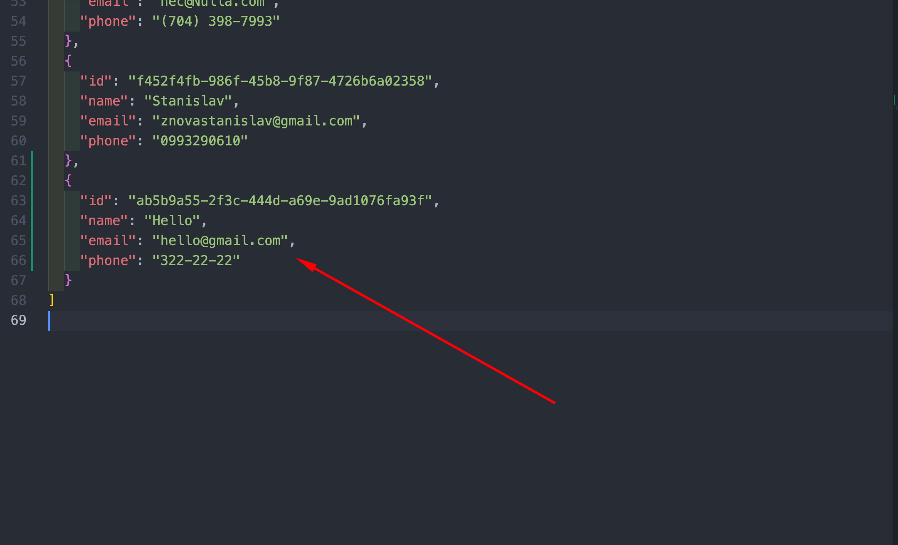
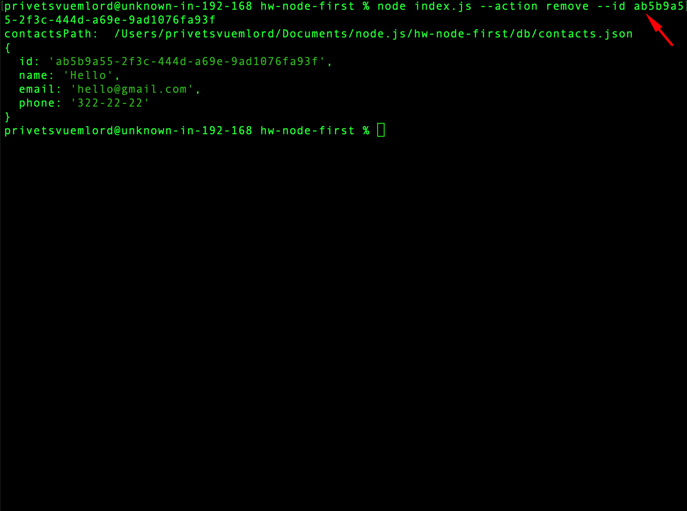
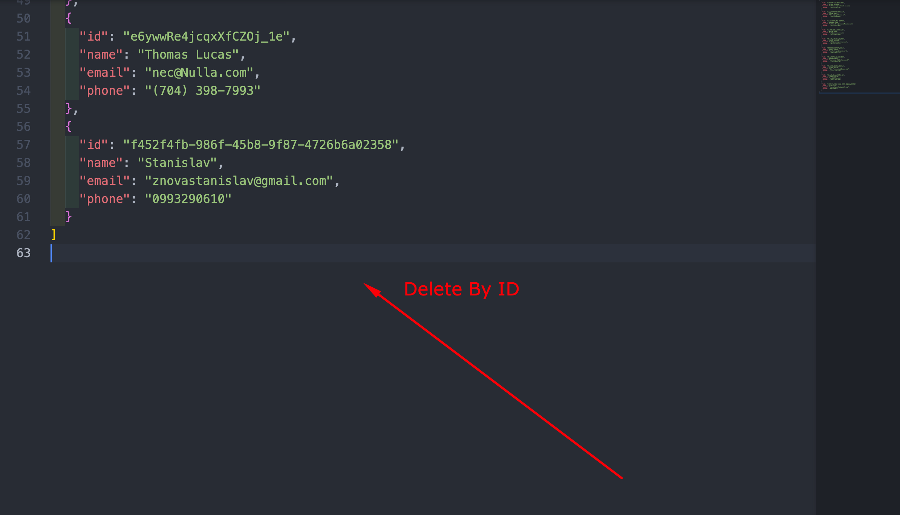

# hw-node-first

node index.js --action list

node index.js --action get --id

node index.js --action add

node index.js --action remove --id

you can watch the video and you will see result on video(open first link and you get video)

Good Luck!
